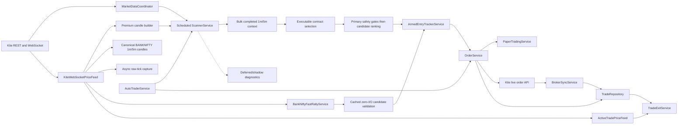

# Current Architecture

## Purpose and authority

This document describes how the Bank Nifty option-buying application works now. It is the canonical architecture overview for the repository.

- Read this document before changing service boundaries, runtime wiring, market-data handling, persistence, or broker integration.
- Use [TRADING_FLOW.md](TRADING_FLOW.md) for the entry and exit sequence.
- Use [DECISIONS.md](DECISIONS.md) for the reasons behind important design choices.
- Root-level audit and map files are useful historical reports, but they are not the source of truth when they disagree with these documents or the current code.

The application is a modular monolith: one FastAPI process composes the providers, services, repositories, background workers, WebSocket callbacks, and HTTP endpoints. `app/api.py` is the composition root.

## Scope and safety boundary

The executable trading scope is intentionally narrow:

- Underlying: `BANKNIFTY` / `NIFTY BANK`.
- Instruments: NSE/NFO Bank Nifty options.
- Entries: option buying only (`BUY_CE` and `BUY_PE`).
- Expiry and instrument tokens: resolved from live broker instrument data; they must not be hardcoded.
- Default order mode: paper.
- Armed WebSocket entry: paper-only in the current implementation.
- Live order routing: available only through `OrderService` when live configuration, explicit confirmation, execution-quality checks, broker reconciliation, funds, and risk checks all pass.

## System map

## Authoritative risk and episode boundary

`RiskPolicyService` is the pure position-risk authority. It receives an immutable `RiskDecisionContext`, approves or downgrades the requested tier, models entry/exit slippage and allocated costs, and returns the approved percentage/amount, risk per unit/lot, maximum quantity, and structured reasons. Scanner score, indicator count, and heuristic confidence are not inputs. The process hard ceiling is 5%; an invalid configured ceiling fails closed.

The evidence-research tier spectrum remains 1%, 2%, 3%, and 5%, with active paper and live policy capped at `TIER_1_BASE`; evidence-gated higher tiers remain disabled. An explicit operator policy, versioned as `banknifty_risk_v2`, currently sets the active risk budget to 4% for both modes without relabelling it as validated tier evidence. Paper therefore budgets at most ₹4,000 from its fixed ₹1,00,000 capital; live budgets at most 4% of current Zerodha equity. The configured per-trade ceiling is 4% and the process hard ceiling remains 5%. Shadow evaluation still computes the research tiers and persists them with `counterfactual_can_reach_order_router=false`; it never changes active quantity.

`PreOrderRiskService` is the final authority shared by all `OrderService` callers. Scheduled automation, manual paper/live requests, armed WebSocket entries, and promoted fast plans therefore pass the same account, tier, stop-loss, quantity, session, execution, duplicate, and conditional live-safety checks. Paper/live differ only after approval in fill mechanics and broker protection. Scanner sizing is provisional; final order quantity is recomputed from current executable evidence.

`EpisodeReservationService` derives a strategy/risk-policy/contract/setup/trigger/time-window identity and atomically moves it through `AVAILABLE -> RESERVED -> ORDER_PENDING -> OPEN -> CLOSED`. These persistence labels map to the canonical lifecycle as `AVAILABLE=PREPARED` and `RESERVED=TRIGGERED`; the shared transition vocabulary is `UNAVAILABLE -> OBSERVE -> PREPARED -> ARMED -> TRIGGERED -> ORDER_PENDING -> OPEN -> EXITING -> CLOSED`, with terminal `INVALIDATED` and `EXPIRED` states. Concurrent or repeated routes cannot acquire the same episode. Expired recovery compares the old token and expiry as well as state, preventing two reclaimers from both succeeding. Pre-submission failures release their reservation; an accepted or durably persisted order retains a lock until reconciliation or closure.

`DecisionEvidenceRepository` appends immutable scanner, fast-rally, and pre-order records to `decision_risk_evidence`. Final pre-order authorization first commits a minimal crash-safe order intent in the same transaction as the atomic episode reservation. `EvidencePersistenceQueue` then writes the large append-only context and counterfactual JSON on a bounded worker. Queue saturation is explicit and fails an authorized attempt closed before submission; retries, metrics, durable intent recovery, and dead-letter status are exposed. A broker-acknowledged order whose local trade write is interrupted remains `ORDER_PENDING` with its broker ID and blocks live automation during startup reconciliation. Schema creation and legacy-column inspection run only during `init_db()`, never on ordinary `get_session()` calls.

`EpisodeOutcomeCollector` registers one primary path per episode and accepts WebSocket events through a non-blocking bounded queue. It follows underlying and selected-option exchange/receive time, executable ask entry, executable bid exit, depth, spread, gaps, reconnects, fixed horizons, session cutoff, and original stop/target resolution. Missing executable quotes remain missing; coverage, dropped events, LTP-only target/stop appearances, and undeterminable outcomes are explicit. `EventTimeReplayService` reuses the shadow-policy and outcome interfaces with exchange-time ordering, receive-time tie-breaking, candle lifecycle/provenance, instrument-master lineage, deterministic hashes, and no order-routing dependency.

`AccountEquityStateService` is the authoritative market-valued account-state calculation. It separates broker cash, executable-bid open value, realized and unrealized P&L, planned and open-stop risk, premium exposure, loss streak, start/peak/current equity, and drawdown. The order-mode risk basis is explicit: paper sizing and percentage caps always use the fixed configured `ACCOUNT_EQUITY` (₹1,00,000 by default), while live sizing and affordability use Zerodha funds/current audited broker equity. Paper still uses durable paper P&L, exposure, stop-risk, loss-streak and executable-bid coverage for its other account gates; the connected Zerodha cash balance cannot resize or block a paper trade. The final risk path calculates state without an append-only snapshot write; `/risk/equity/snapshot` persists an audited broker-marked snapshot explicitly. A missing executable bid values an open option at zero and blocks a new entry rather than substituting LTP.

## Runtime composition

`app/api.py` creates shared runtime objects rather than letting each request build an independent trading system. Important shared objects include:

| Component | Responsibility |
|---|---|
| `KiteProvider` / `KiteFeed` | Broker REST access, instruments, quotes, historical data, margins, and orders. |
| `MarketDataCoordinator` | Coordinates and caches broker market-data requests. |
| `KiteWebSocketPriceFeed` | Tick ingestion, ownership-based subscriptions, priority event delivery, gap reporting, and premium candle construction. |
| `UnderlyingCandleService` | Builds exchange-timestamped, current-session canonical `BANKNIFTY` 1-minute candles and completed 5-minute aggregates without lookahead. |
| `RawTickCaptureService` / `TickReplayService` | Asynchronously retain replay-relevant ordered ticks and replay them by capture sequence. |
| `FastScanContextService` | Holds completed 1m/5m state, direction/regime/day structure, constituent participation, freshness/gaps, lineage and prewarmed option details. Cached validation performs no REST or database work. |
| `LatencyMetricsService` | Keeps bounded latency samples, tail percentiles, queue drops, last events, and strategy/config lineage. |
| `BankNiftyIntelligenceService` | Loads a locally versioned official NSE Indices 14-member weight snapshot, measures available weight coverage, and keeps stale or incomplete constituent evidence from creating false confidence. |
| `ExecutablePriceService` | Converts long-option bid depth into a conservative quantity-aware sell price and classifies whether the quote is safe for paper targets or live software exits. |
| `BankNiftyOptionPrewarmService` | Keeps the nearest-expiry ATM ± configured strike depth CE/PE band warm. The current default depth is 3. |
| `BankNiftyFastRallyService` | Detects short-window Bank Nifty acceleration and requests an immediate scan. |
| `AutoTraderService` | Runs scheduled scans, serialized cache-only fast validations, explicit call-budget accounting, and optional routing through the shared transactional episode/risk authority. |
| `ScannerService` | Builds and evaluates Bank Nifty opportunities, records accepted/rejected outcomes, and registers early armed setups. |
| `MultiTimeframeContextService` | Loads only completed 1-minute and 5-minute Bank Nifty candles in one bounded query. The 5-minute frame owns setup/regime/day structure; 1-minute owns entry timing. |
| `MarketRegimeService` | Classifies structure, volatility, participation, location, and execution into a confidence/uncertainty-aware option-buying regime with invalidation. |
| `MomentumPhaseService` / `SetupFamilyClassifierService` | Separates formation, acceleration, breakout, confirmation, continuation, exhaustion and failure, then applies a regime-specific setup/exit policy. |
| `TradeCandidateRankingService` | Orders candidates using reward/risk, spread, costs, liquidity, uncertainty and policy quality without mislabeling utility as probability. |
| `TradeSetupService` | Resolves expiry, ranks executable contracts using ask/bid, spread, depth, OI, volume, Greeks/DTE when available, applies stickiness, and builds premium-based SL/targets/quantity. |
| `ArmedEntryTrackerService` | Persists and recovers selected option setups, reports subscription health truthfully, tracks ticks, and executes confirmed paper entries. |
| `OrderService` | Validates scanner-originated Bank Nifty option-buying signals, invokes the shared pre-order authority, and routes only reserved/approved episodes to paper or explicitly authorized live execution. |
| `RiskManagementService` | Reports account-level daily loss, trade/stop/loss-streak, cooldown, open-trade, premium, planned-risk, and open-risk state. |
| `RiskPolicyService` / `PreOrderRiskService` | Separates setup eligibility from evidence-gated risk tiers, enforces the hard 5% ceiling and cost-aware stop-risk sizing, and provides one final paper/live gate. |
| `EpisodeReservationService` | Owns deterministic episode keys and atomic reservation/order/open/closed transitions across every entry route. |
| `DecisionEvidenceRepository` | Appends immutable decision/risk contexts and separate counterfactual/realized outcome records. |
| `EvidencePersistenceQueue` | Bounded asynchronous large-evidence writer with retry, queue-full, dead-letter, and durable order-intent recovery. |
| `EpisodeOutcomeCollector` | Tracks one executable bid/ask market path per episode across fixed and stop/target horizons without blocking the WebSocket callback. |
| `EventTimeReplayService` | Deterministic exchange-time replay with candle lifecycle, provenance, instrument lineage, and bar-only/tick-capable separation. |
| `ShadowEntryPolicyComparisonService` | Runs the unchanged baseline, transition-preparation, and continuous-transmission policies against the same immutable context with no order dependency. |
| `AccountEquityStateService` | Produces reproducible equity/drawdown/risk snapshots using executable option bids. |
| `StopExitLiquidityResearchService` | Reports current-book, historical adverse-move, and stress exit estimates without promising fills or changing the active proxy. |
| `PolicyEvaluationService` | Evaluates unique episode-policy pairs with after-cost metrics, chronological purge/embargo folds, segmentation, and risk-tier counterfactuals. |
| `ActiveTradePriceFeed` | Uses fresh WebSocket ticks first and controlled broker polling fallback for active trades. |
| `TradeExitService` | Evaluates deterministic stop/time/trailing/invalidation/target priority against executable bid/depth, records simultaneous triggers, and performs paper/live square-off. |
| `BrokerSyncService` | Reconciles local live trades, broker positions, entry/exit orders, and protective disaster stops; protection failures persistently block new live entries. |
| `EvidenceMatrixService` / `StrategyPromotionService` | Segment independent outcomes and make manual, non-self-modifying promotion recommendations. |
| Repository services | Persist candles, opportunities, rejections, armed entries, trades, strategy versions, validations, and runtime jobs. |

The shared `TradeSetupService` is deliberate: its in-memory Bank Nifty contract stickiness must survive across scanner instances created for separate requests or scans.

## Startup and shutdown

At application startup:

1. `ensure_access_token_for_today()` checks the dated, git-ignored `access_token.txt`. A token stamped for today is verified with a read-only Kite profile call. If missing or invalid, a still-valid legacy `.env` token is migrated once; otherwise, when enabled and fully configured, headless Chrome performs Kite user/password/TOTP login, exchanges the redirect request token, validates the new access token, and atomically writes the dated token file. The token value is never logged or returned by status APIs.
2. The current token is applied to the shared REST provider, scanner feed, and WebSocket runtime before any market-data or automation worker starts. Missing/failed automatic credentials leave Kite-dependent modules unavailable rather than using a stale token.
3. Strategy-version registration, valid armed-entry recovery, old WebSocket candle cleanup, and raw-tick retention cleanup run in background maintenance.
4. Pending evidence is reconstructed from durable order intents; broker order/trade synchronization and startup position reconciliation run separately. Unresolved live order intents block automation.
5. If WebSocket support is enabled, the market-data runtime starts.
6. The `NIFTY BANK` instrument token is resolved from the broker's current NSE instrument list.
7. That underlying token is assigned to the fast-rally detector and canonical candle builder, mapped to `BANKNIFTY`, and subscribed under the `core_market` owner.
8. If the market is open, an initial scanner refresh is requested.
9. If automation is configured, the automation supervisor starts its market-hours lifecycle.

`app/providers/token_store.py` is the sole runtime access-token source. It stores JSON metadata and the token atomically in repository-root `access_token.txt`, accepts it only for the current Asia/Kolkata date, and exposes redacted status. `KITE_ACCESS_TOKEN` in `.env` is deprecated and read only by the startup bootstrap for one-time migration. Browser-login credentials remain in the git-ignored `.env`; source files and `access_token.txt` are never credential sources checked into Git.

For unattended Windows operation, Task Scheduler starts `scripts/start_scheduled_trading_app.ps1` at 09:00 on weekdays under the local trading user with an S4U background logon. Before launching the runtime, the PowerShell launcher checks local MySQL port 3306 and, when unavailable, starts the installed XAMPP MySQL runtime (`XAMPP_ROOT` when configured, otherwise the local `C:\xamppp`/`C:\xampp` installation) and waits up to 60 seconds for the port. It then runs `scripts/ensure_database.py`, which uses the configured `DATABASE_URL` credentials to create the validated MySQL schema name idempotently before application table initialization. A missing or still-unreachable server/schema fails startup before trading automation begins. The task requires network availability, retries process failures and supports battery operation. Its Python runner observes the durable supervisor completion reason; after outcome evaluation and the after-market research pipeline finish, it requests graceful Uvicorn shutdown and sends a final Telegram safe-to-power-off notification. A 20-hour scheduler limit is an emergency hung-process ceiling rather than the normal shutdown mechanism. Per-run task output is retained in the local git-ignored `logs/` directory.

The scheduled Python runner verifies morning startup from outside the FastAPI lifespan after Uvicorn has bound its port. For up to `SCHEDULED_STARTUP_HEALTH_TIMEOUT_SECONDS` (180 seconds by default), it checks the API, database, completed startup maintenance, completed broker synchronization/reconciliation, Kite profile login, connected WebSocket, `core_market` Bank Nifty subscription, absence of an active feed gap, the OS-level single-instance lock, and a healthy automation-supervisor task. It sends one Telegram success message only when every check passes; a failed timeout now shuts the unverified server down instead of allowing it to trade silently. During the run it checks session-aware API/database/Kite/WebSocket/feed-gap health, supervisor/worker task state, and new worker errors. Persistent health incidents are deduplicated until recovery, and a recovery notification closes an active health incident. Import failure, bind failure, early server exit, unexpected supervisor stop, failed shutdown hooks, and abnormal outer-process exit produce bounded non-secret failure alerts and point the operator to the scheduled-run logs. Generic supervisor/auto-trader lifecycle alerts are suppressed in the scheduled profile so the runner remains the sole owner of startup, runtime-failure, recovery, and day-complete messages.

`RuntimeInstanceLock` acquires `logs/banknifty-app.lock` before token bootstrap or any worker starts. On Windows it inspects file size without reading the protected byte, then obtains the byte-range lock; reading that byte before acquisition can itself fail when another process owns the range. A second Uvicorn process therefore fails before it can start automation, even though Uvicorn normally runs lifespan startup before discovering a port-bind conflict. The lock is process-wide and applies even if a different port is requested; running a second trading runtime is not a supported development workaround. It is released only by startup rollback or the application shutdown path. The already-hidden PowerShell launcher invokes Python directly and waits for it, rather than using `Start-Process`, so case-duplicate inherited variables such as `Path`/`PATH` cannot crash child creation and the Windows networking environment remains intact. Application configuration remains sourced from the project `.env`, and the Python runner applies its scheduled lifecycle profile.

The supervisor is process-restart aware. Each start writes a durable runtime-job record containing a process boot ID and PID. If the next process finds an unfinished run for the same trading date, it closes that run as interrupted before starting a new one. A continuously boot-managed supervisor remains alive after the after-market pipeline so it can restart intraday workers on the next market day; an explicitly marked Windows scheduled run instead records completion and exits. `GET /automation/status` exposes the effective `execution_profile`, completion-policy flags, and a derived operator state. `DAY_COMPLETE` explicitly means research is complete and `trading_active=false`, even when a continuous supervisor loop remains alive. Every cycle verifies that the collector, auto trader, and outcome monitor have both a running flag and a live task; stale `running=true` state is repaired and the worker is restarted.

Shutdown stops the market-data runtime, canonical candle and raw-tick writers, automation supervisor, snapshot collector, auto trader, and outcome monitor, then flushes and stops the evidence and episode-outcome workers.

## WebSocket subscription model

Subscriptions are owner-based. A token remains subscribed while at least one owner still needs it, preventing one subsystem from accidentally unsubscribing another.

| Owner | Typical mode | Purpose |
|---|---|---|
| `core_market` | `quote` | Bank Nifty underlying ticks for acceleration detection. |
| `banknifty_prewarm` | `quote` | Near-ATM CE/PE band used for warm prices and candle context. |
| `armed:<setup_id>` | `full` | Bid, ask, volume, and price confirmation for one armed setup. |
| `active_trade` | `full` | Fresh prices for open-position monitoring and exits. |

The effective token mode is the highest mode requested by any owner. Band rotation subscribes the new ATM band first and retires the old band after an overlap lease. Rotation hysteresis avoids needless churn around the ATM boundary.

The event queue prioritizes:

1. Broker order updates.
2. Data-gap events.
3. Armed-entry and active-trade ticks.
4. Ordinary warm-market ticks.

Order execution is moved off the WebSocket callback path so a broker/database operation does not stall tick ingestion.

An armed setup is operational only when its subscription is broker-requested or fresh-tick verified. Disconnected subscriptions are explicitly queued; subscription failures cancel registration instead of displaying a false armed state. Valid setup payloads are stored in `armed_entries`, rehydrated after restart, and resubscribed under the original owner.

A connection gap is cleared only by positive recovery evidence: the SDK connection callback or a fresh received tick while the regular market is open. A reconnect-attempt callback does not clear the gate. Fresh ticks also repair a missed SDK connection callback by restoring `CONNECTED` state and emitting one recovered-gap event. Status exposes recovery count, time, and reason.

## Decision hierarchy

The experimental v7 entry policy uses only completed `1minute` and `5minute` candles. Five-minute evidence is the sole directional authority. Direction comes from explicit swing progression, multi-candle impulse breadth, pullback retention and breakout acceptance; moving averages are not direction inputs and one candle cannot choose CE or PE. A neutral five-minute structure remains `WATCHING_SETUP` rather than guessing CE/PE or creating a rejected-opportunity record. Until 09:45 IST, the opening policy is ready with five completed 1-minute and three completed 5-minute candles. After that, both frames require `STRUCTURE_MIN_COMPLETED_CANDLES` (six by default). One-minute evidence owns timing: an opposing one-minute direction pauses an otherwise executable setup as `WATCHING_SETUP`, while neutral or aligned one-minute evidence does not veto the five-minute direction. Ticks remain execution evidence only. Daily, 15-minute and 30-minute candles are not queried, generated or evaluated by the strategy.

Active hard gates are limited to universal market-session enforcement; canonical/fresh/gap-safe data; a valid five-minute direction; a current valid contract; positive executable bid/ask; bounded spread; one-lot entry/stop-exit depth; expiry/minimum-premium policy; valid stop/target geometry; numerical chase, target-room and remaining reward/risk; account risk; duplicate prevention; and live broker/reconciliation/protective-stop safety. `EntryOpportunityService` is shared by scheduled timing, fast-rally validation and armed-tick execution. Expected-move and nearby-level estimates always warn rather than veto; numerical target room and remaining reward/risk still cannot be bypassed.

Unvalidated strategy confirmation is not a permanent rejection gate. Premium momentum, latest premium candle, breakout readiness, ordinary constituent alignment, option-quality score, composite liquidity, volume, OI and contextual expected-move/level evidence remain timing or ranking inputs. A premium setup below trigger remains armed/watching. Extreme opposing-heavyweight participation and an opposing one-minute direction pause an otherwise ready entry instead of writing a rejection. Missing/stale premium evidence remains a hard data-availability failure. Weighted scoring ranks candidates but cannot approve unsafe evidence or veto a safe current-version candidate by itself. `MIN_SIGNAL_SCORE` is retained for legacy/manual provenance and research. EMA, MACD, RSI and ADX remain diagnostic-only.

Scheduled scans refresh immutable slow context and a complete paper candidate plan on a completed candle or a controlled 30–60 second interval. A fast-rally event reads that context and the latest prewarmed WebSocket option book directly. Stale/missing context or quotes reject safely; pre-confirmation never falls back to REST, database reads/writes, backfill, margins or instrument downloads. A passing validation promotes the prepared plan through `ArmedEntryTrackerService`, outside the zero-I/O validation budget, where account risk, durable state, subscription ownership and tick quality are rechecked. This is plan promotion into the existing order path, not a second order path. Fast promotion remains paper-only.

Fast-rally observability covers detection, dispatch, suppression, cached validation, and failure. Status retains the latest below-threshold observation and threshold progress, direction counts, callback result/error, validation counters, suppression reasons, and the last cached decision. Every threshold crossing creates a dispatch event; cooldown, an already-running validation, a stopped auto trader, thread-start failure, gate rejection, and validation exception therefore remain visible in the decision feed. Any REST or database activity measured during cached validation forces a safe `fast_candidate_io_budget_exceeded` rejection.

## Tick and premium-candle handling

Each normalized `WebSocketTick` carries the instrument token, last price, exchange/receive timestamp, cumulative volume when available, bid, ask, five-level depth and quantities when available, timestamp source, and packet type.

The premium candle builder:

- Converts cumulative day volume into positive per-tick increments before adding it to a candle.
- Builds one-minute OHLCV candles by token.
- Inserts flat, zero-volume continuity candles for missing minutes.
- Can persist and rehydrate recent WebSocket-built candles.
- Can recover historical context without pretending recovered candles were live ticks.
- Keeps live-token verification separate from merely requesting a subscription; `is_live_verified()` requires a fresh received tick.

The underlying candle path is separate from option-premium candles. It accepts only broker exchange/last-trade timestamps inside the configured NSE session, persists completed `1minute` candles, aggregates only completed minutes into `5minute`, marks generated in-session continuity rows, and recovers persisted state without replaying it as live ticks. `KiteFeed` combines a fresh exchange-timestamped LTP with these completed candles; broad context quotes use a separate cache and cannot masquerade as indicator evidence.

Raw ticks for `core_market`, `banknifty_prewarm`, `armed:*`, and `active_trade` owners enter a bounded asynchronous writer. Persisted records include depth, both timestamps, sequence, owners, and strategy/config lineage. Warm ticks may be evicted under pressure, but an armed/active tick loss raises critical capture status. Retention is configurable and replay uses persisted capture sequence while exposing sequence gaps.

`ResearchDatasetAuditService` does not equate a calendar date containing ticks with a complete research session. It qualifies only regular-market `BANKNIFTY`/`NIFTY BANK` underlying coverage. A session counts toward readiness only when its first and last ticks are within the configured boundary tolerance, estimated coverage meets the configured minimum, and no internal feed gap exceeds the configured limit. The audit reports observed, complete, and partial dates plus per-date reasons; option ticks cannot make a missing underlying session complete. The defaults are a five-minute boundary tolerance, 98% minimum coverage, and 60-second maximum gap.

The episode collector receives the same normalized tick before strategy dispatch but performs only `put_nowait()` in the callback. Executable path calculations and persistence happen on its worker. Queue-full events increment per-episode dropped evidence and force the outcome to `UNDETERMINABLE_DATA`; persistence retries are bounded and terminal failures appear in collector dead-letter status.

Historical bootstrap is explicit and broker-backed: `POST /data/ingest/banknifty-canonical-bootstrap` requests canonical `BANKNIFTY` `1minute` and `5minute` history, stores only completed regular-session candles with exchange timestamps, and skips duplicates. It never fabricates gaps or treats option/`WS_TOKEN:*` candles as underlying history.

Historical replay applies the same two-timeframe boundary. Every candle, quote and option snapshot is filtered to the replay timestamp, completed-candle cutoffs are enforced, and future database rows cannot affect an earlier decision.

## Constituent intelligence

`app/data/banknifty_constituents_2026-06-30.json` is the reviewed hot-path authority for the 14-member Nifty Bank snapshot. It records the official source/effective date, exact weights and strategy lineage. The refresh script accepts a separately downloaded official NSE Indices sector payload, validates membership and total weight, and refuses an unreviewed constituent change. Staleness is visible and removes hard-gate authority; available-data coverage is calculated by official index weight, with a defensive per-bank hard-gate cap so a few observations cannot dominate.

## Exit execution model

For a long option, LTP is diagnostic only. A full quantity-covered five-level bid book produces a depth-weighted executable sell price. Partial depth uses the worst visible bid conservatively but cannot prove a target fill or authorize a live software exit. A best bid without quantity may support paper execution but is live-unsafe; LTP alone never fills a target or exit. Stored exit evidence includes LTP, best bid/ask, executable price, coverage, spread, source, quote time, first rule and all simultaneous rules.

Exit priority is deterministic: stop, conditional time/near-close, high-watermark trailing, underlying/premium invalidation, then targets. At the setup profile's R multiple, positions of at least two exchange lots book a whole-lot partial once and retain at least one whole-lot runner. One-lot positions cannot manufacture an invalid fractional partial. Live partial execution remains disabled until a broker-fill confirmation state machine earns evidence.

Time-stop duration, trailing activation, partial R and target style come from the persisted setup-family exit profile. Trend/expansion runners receive the configured time extension; normal and reversal setups do not. The runner trails the option premium high-watermark by the greater of option ATR distance and an original-risk floor, with move-to-cost behavior after a partial when enabled. No profile may weaken the original hard stop.

## Latency measurement

The in-memory latency report always exposes the required path metrics even with zero samples: exchange-to-receive, receive-to-rally detection, detection-to-scan, scheduled and fast scan durations, armed-tick processing, risk-tier evaluation, final pre-order validation, scan-to-arm, arm-to-confirmation, confirmation-to-submission, submission-to-acknowledgement, acknowledgement-to-fill, and exit trigger-to-submission/acknowledgement/fill. Every metric reports p50/p95/p99, sample count and missing count; queue drop totals are separate. Broker/database consumers are queued off the WebSocket event callback, while latency recording is bounded in-memory work.

## Gap semantics

Not every absence of ticks means the feed is broken:

- A long interval between ticks for one option is recorded as token inactivity. It is diagnostic-only and does not cancel an armed trade.
- A connection-level WebSocket gap is entry-blocking while active.
- A recovered gap is non-blocking.
- Token-scoped blocking events affect only setups for the relevant token; connection-scoped events may affect every armed setup.

These semantics prevent illiquid or temporarily quiet contracts from cancelling unrelated opportunities while still protecting entries during genuine feed loss.

KiteTicker is the sole reconnect scheduler. Application callbacks update health/gap state but never call `reconnect()` themselves, avoiding duplicate retry loops from paired error/close callbacks. The SDK is created with bounded retries and exponential delay. Authentication, market-close and broker `429 TooManyRequests` outcomes stop the SDK retry factory. A 429 also starts a persisted-in-service cooldown during which subscription requests may remain queued but cannot create a new WebSocket connection.

## Persistence and operational records

The database layer stores, among other records:

- Market and option candles.
- Option quote snapshots.
- Signals and accepted opportunities.
- Rejected opportunities with structured reasons.
- Paper/live trade lifecycle records.
- Strategy versions and validation results.
- Raw ticks and independent setup episodes.
- Runtime job history.
- Durable armed-entry lifecycle payloads and states.

Accepted and rejected opportunities must remain explainable. A hard-gate rejection, armed-entry expiry, chase rejection, data-gap cancellation, or order failure should retain its reason in repository records and diagnostics.

Scanner diagnostic enrichment depends only on the rejection repository's public `market_session()` capability. The scanner-parity backtest injects a no-op repository that reports `BACKTEST`, retains rejection diagnostics in the replay result, and never writes rejected-opportunity rows or depends on private live-repository methods.

Repeated scanner rejections share an episode. An identical gate/contract/5-minute state increments the episode rather than inserting another rejection row; a gate change, contract change, new completed 5-minute state, or new episode creates a new record. Automation rejection persistence is queued away from the decision thread, while orders, trades, risk, armed entries and reconciliation remain synchronous and durable.

Opportunities, rejection observations/episodes, validations, trades, raw replays, and latency events carry strategy version and config hash. Mixed hashes are surfaced and block professional readiness; paper mode may continue visibly, while direct live routing fails closed on unregistered drift.

## Configuration authority

`app/config.py` defines environment-backed settings. `.env.example` is the checked-in configuration reference; `.env` is machine-specific runtime configuration and must not be treated as documentation.

Safety-sensitive defaults include:

- `ORDER_MODE=paper`
- `ENABLE_EVENT_DRIVEN_PAPER_ENTRY=true`
- `ENABLE_EVENT_DRIVEN_LIVE_ENTRY=false`
- `ENABLE_DIRECTIONAL_ROOM_HARD_GATE=false`
- `BANKNIFTY_PREWARM_STRIKE_DEPTH=3`
- `ARMED_ENTRY_VALID_SECONDS=90`
- `FAST_RALLY_WINDOW_SECONDS=5.0`
- `FAST_RALLY_TRIGGER_PCT=0.08`
- `STRATEGY_VERSION=banknifty_option_buying_v7`
- `ENFORCE_MARKET_HOURS=true`
- `ACTIVE_DECISION_TIMEFRAMES=1minute,5minute`
- `STRUCTURE_MIN_COMPLETED_CANDLES=6`
- `OPENING_STRUCTURE_MIN_1M_CANDLES=5`
- `OPENING_STRUCTURE_MIN_5M_CANDLES=3`
- `SCHEDULED_SCAN_MAX_REST_CALLS=3`
- `WEBSOCKET_RECONNECT_MAX_DELAY_SECONDS=60`
- `WEBSOCKET_RATE_LIMIT_COOLDOWN_SECONDS=120`
- `ENABLE_HIERARCHICAL_MARKET_STATE=true`
- `ARMED_ENTRY_RECOVERY_ENABLED=true`
- `REQUIRE_BROKER_PROTECTIVE_STOP_FOR_LIVE_ENTRY=true`
- `ENABLE_BROKER_EMERGENCY_SL=false`

The last two defaults deliberately block live entry until broker-side protection is explicitly enabled and verified. Even after that, live routing remains subject to paper/live mode flags, confirmation, strategy registration/config drift, reconciliation, funds, execution quality and account risk.

Changing a default is a behavior change and requires tests plus updates to this document, [TRADING_FLOW.md](TRADING_FLOW.md), or [DECISIONS.md](DECISIONS.md) as applicable.

## Operational inspection

Use these endpoints to understand the running system:

| Endpoint | Purpose |
|---|---|
| `GET /runtime/status` | High-level runtime status. |
| `GET /runtime/latency` | p50/p95/p99/max/sample and last-event latency detail with queue drops. |
| `GET /risk/policy/status` | Active/shadow tier configuration, unbreakable process ceiling, activation switches, and explicit policy conflicts. |
| `GET /market-data/pipeline-status` | Canonical candle coverage, raw-tick capture, fast context, WebSocket queues, and latency. |
| `GET /automation/status` | Automation lifecycle and worker status. |
| `GET /alerts/status` | Telegram configuration and the last secret-free delivery attempt. |
| `GET /kite/websocket/status` | Connection, owners, subscriptions, queue, gaps, candles, and fast-rally status. |
| `GET /scanner/opportunities` | Accepted scanner opportunities. |
| `GET /scanner/diagnostics` | Gate, score, contract, and rejection explanations. |
| `GET /scanner/armed-entries` | Armed, pending, entered, expired, too-late, and cancelled setup states. |
| `GET /research/evidence-matrix` | Version-separated setup/regime outcome cells; rejections never enter trade expectancy. |
| `GET /research/dataset-audit` | Complete-versus-partial underlying sessions, coverage gaps, and whether the mechanical evidence minimum is met. |
| `GET /research/strategy-promotion` | Advisory promotion checks; never mutates live settings. |
| `GET /research/professional-readiness` | Non-blocking cached readiness from the after-market research lane. |
| `GET /risk/status` | Account-level entry risk and reconciliation state. |
| `GET /trades` | Persisted paper/live trade lifecycle records. |
| `GET /trades/exit-alerts` | Stuck or mismatched live exits. |
| `GET /broker/reconciliation/status` | Broker/local mismatch and live-trading block status. |

The read-only operator dashboard is intentionally smaller than the API surface. It renders derived operational truth, critical runtime expectations, current action-required incidents, actual daily trade/risk records, every open trade and exit alert, the current setup/armed entry, one canonical market-data health card, research/readiness honesty, Telegram delivery state, and ten recent decisions. It does not present saved opportunity analytics as today's P&L, does not mark scheduled after-hours worker stops as failures, and does not expose live-mode or automation mutation controls. Detailed diagnostics and research remain linked on demand instead of being polled into a wall of raw JSON and duplicate tables. The decision feed still distinguishes normal candidate rejection from operational failure and includes a scanner heartbeat when no opportunity is actionable.

## Maintenance checklist

When architecture changes, update the documentation in the same change:

1. Update this file for components, ownership, runtime wiring, storage, or configuration boundaries.
2. Update [TRADING_FLOW.md](TRADING_FLOW.md) for gates, scoring, states, entry, order, or exit behavior.
3. Add or amend a record in [DECISIONS.md](DECISIONS.md) when the rationale or trade-off changes.
4. Update `.env.example` when a setting is added or renamed.
5. Add tests for trading-logic changes and run the relevant focused and full suites.
