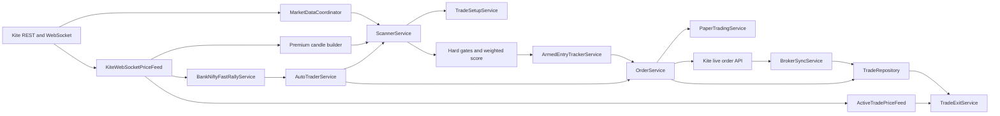

# Current Architecture

## Purpose and authority

This document describes how the Bank Nifty option-buying application works now. It is the canonical architecture overview for the repository.

- Read this document before changing service boundaries, runtime wiring, market-data handling, persistence, or broker integration.
- Use [TRADING_FLOW.md](TRADING_FLOW.md) for the entry and exit sequence.
- Use [DECISIONS.md](DECISIONS.md) for the reasons behind important design choices.
- Root-level audit and map files are useful historical reports, but they are not the source of truth when they disagree with these documents or the current code.

The application is a modular monolith: one FastAPI process composes the providers, services, repositories, background workers, WebSocket callbacks, and HTTP endpoints. `app/api.py` is the composition root.

## Scope and safety boundary

The executable trading scope is intentionally narrow:

- Underlying: `BANKNIFTY` / `NIFTY BANK`.
- Instruments: NSE/NFO Bank Nifty options.
- Entries: option buying only (`BUY_CE` and `BUY_PE`).
- Expiry and instrument tokens: resolved from live broker instrument data; they must not be hardcoded.
- Default order mode: paper.
- Armed WebSocket entry: paper-only in the current implementation.
- Live order routing: available only through `OrderService` when live configuration, explicit confirmation, execution-quality checks, broker reconciliation, funds, and risk checks all pass.

## System map

## Runtime composition

`app/api.py` creates shared runtime objects rather than letting each request build an independent trading system. Important shared objects include:

| Component | Responsibility |
|---|---|
| `KiteProvider` / `KiteFeed` | Broker REST access, instruments, quotes, historical data, margins, and orders. |
| `MarketDataCoordinator` | Coordinates and caches broker market-data requests. |
| `KiteWebSocketPriceFeed` | Tick ingestion, ownership-based subscriptions, priority event delivery, gap reporting, and premium candle construction. |
| `BankNiftyOptionPrewarmService` | Keeps the nearest-expiry ATM ± configured strike depth CE/PE band warm. The current default depth is 3. |
| `BankNiftyFastRallyService` | Detects short-window Bank Nifty acceleration and requests an immediate scan. |
| `AutoTraderService` | Runs scheduled scans, serialized fast rescans, optional order routing, and duplicate live-order protection. |
| `ScannerService` | Builds and evaluates Bank Nifty opportunities, records accepted/rejected outcomes, and registers early armed setups. |
| `TradeSetupService` | Resolves expiry, selects a liquid contract, applies contract stickiness, and builds premium-based SL/targets/quantity. |
| `ArmedEntryTrackerService` | Tracks a selected option tick by tick and executes confirmed paper entries. |
| `OrderService` | Validates scanner-originated Bank Nifty option-buying signals and routes them to paper or explicitly authorized live execution. |
| `RiskManagementService` | Enforces account-level daily loss, trade count, stop count, cooldown, open-trade, and exposure limits. |
| `ActiveTradePriceFeed` | Uses fresh WebSocket ticks first and controlled broker polling fallback for active trades. |
| `TradeExitService` | Evaluates stops, targets, invalidation, partial exit configuration, and paper/live square-off. |
| `BrokerSyncService` | Reconciles local live trades with broker positions/orders and blocks unsafe live trading on mismatches. |
| Repository services | Persist candles, opportunities, rejections, trades, strategy versions, validations, and runtime jobs. |

The shared `TradeSetupService` is deliberate: its in-memory Bank Nifty contract stickiness must survive across scanner instances created for separate requests or scans.

## Startup and shutdown

At application startup:

1. Strategy-version registration and old WebSocket candle cleanup run in background maintenance.
2. Broker order/trade synchronization and startup position reconciliation run separately.
3. If WebSocket support is enabled, the market-data runtime starts.
4. The `NIFTY BANK` instrument token is resolved from the broker's current NSE instrument list.
5. That underlying token is assigned to the fast-rally detector and subscribed under the `core_market` owner.
6. If the market is open, an initial scanner refresh is requested.
7. If automation is configured, the automation supervisor starts its market-hours lifecycle.

Shutdown stops the market-data runtime, automation supervisor, snapshot collector, auto trader, and outcome monitor.

## WebSocket subscription model

Subscriptions are owner-based. A token remains subscribed while at least one owner still needs it, preventing one subsystem from accidentally unsubscribing another.

| Owner | Typical mode | Purpose |
|---|---|---|
| `core_market` | `quote` | Bank Nifty underlying ticks for acceleration detection. |
| `banknifty_prewarm` | `quote` | Near-ATM CE/PE band used for warm prices and candle context. |
| `armed:<setup_id>` | `full` | Bid, ask, volume, and price confirmation for one armed setup. |
| `active_trade` | `full` | Fresh prices for open-position monitoring and exits. |

The effective token mode is the highest mode requested by any owner. Band rotation subscribes the new ATM band first and retires the old band after an overlap lease. Rotation hysteresis avoids needless churn around the ATM boundary.

The event queue prioritizes:

1. Broker order updates.
2. Data-gap events.
3. Armed-entry and active-trade ticks.
4. Ordinary warm-market ticks.

Order execution is moved off the WebSocket callback path so a broker/database operation does not stall tick ingestion.

## Tick and premium-candle handling

Each normalized `WebSocketTick` carries the instrument token, last price, exchange/receive timestamp, cumulative volume when available, bid, ask, timestamp source, and packet type.

The premium candle builder:

- Converts cumulative day volume into positive per-tick increments before adding it to a candle.
- Builds one-minute OHLCV candles by token.
- Inserts flat, zero-volume continuity candles for missing minutes.
- Can persist and rehydrate recent WebSocket-built candles.
- Can recover historical context without pretending recovered candles were live ticks.
- Keeps live-token verification separate from merely requesting a subscription; `is_live_verified()` requires a fresh received tick.

## Gap semantics

Not every absence of ticks means the feed is broken:

- A long interval between ticks for one option is recorded as token inactivity. It is diagnostic-only and does not cancel an armed trade.
- A connection-level WebSocket gap is entry-blocking while active.
- A recovered gap is non-blocking.
- Token-scoped blocking events affect only setups for the relevant token; connection-scoped events may affect every armed setup.

These semantics prevent illiquid or temporarily quiet contracts from cancelling unrelated opportunities while still protecting entries during genuine feed loss.

## Persistence and operational records

The database layer stores, among other records:

- Market and option candles.
- Option quote snapshots.
- Signals and accepted opportunities.
- Rejected opportunities with structured reasons.
- Paper/live trade lifecycle records.
- Strategy versions and validation results.
- Runtime job history.

Accepted and rejected opportunities must remain explainable. A hard-gate rejection, armed-entry expiry, chase rejection, data-gap cancellation, or order failure should retain its reason in repository records and diagnostics.

## Configuration authority

`app/config.py` defines environment-backed settings. `.env.example` is the checked-in configuration reference; `.env` is machine-specific runtime configuration and must not be treated as documentation.

Safety-sensitive defaults include:

- `ORDER_MODE=paper`
- `ENABLE_EVENT_DRIVEN_PAPER_ENTRY=true`
- `ENABLE_EVENT_DRIVEN_LIVE_ENTRY=false`
- `ENABLE_DIRECTIONAL_ROOM_HARD_GATE=false`
- `BANKNIFTY_PREWARM_STRIKE_DEPTH=3`
- `ARMED_ENTRY_VALID_SECONDS=90`
- `FAST_RALLY_WINDOW_SECONDS=5.0`
- `FAST_RALLY_TRIGGER_PCT=0.08`

Changing a default is a behavior change and requires tests plus updates to this document, [TRADING_FLOW.md](TRADING_FLOW.md), or [DECISIONS.md](DECISIONS.md) as applicable.

## Operational inspection

Use these endpoints to understand the running system:

| Endpoint | Purpose |
|---|---|
| `GET /runtime/status` | High-level runtime status. |
| `GET /automation/status` | Automation lifecycle and worker status. |
| `GET /kite/websocket/status` | Connection, owners, subscriptions, queue, gaps, candles, and fast-rally status. |
| `GET /scanner/opportunities` | Accepted scanner opportunities. |
| `GET /scanner/diagnostics` | Gate, score, contract, and rejection explanations. |
| `GET /scanner/armed-entries` | Armed, pending, entered, expired, too-late, and cancelled setup states. |
| `GET /risk/status` | Account-level entry risk and reconciliation state. |
| `GET /trades` | Persisted paper/live trade lifecycle records. |
| `GET /trades/exit-alerts` | Stuck or mismatched live exits. |
| `GET /broker/reconciliation/status` | Broker/local mismatch and live-trading block status. |

## Maintenance checklist

When architecture changes, update the documentation in the same change:

1. Update this file for components, ownership, runtime wiring, storage, or configuration boundaries.
2. Update [TRADING_FLOW.md](TRADING_FLOW.md) for gates, scoring, states, entry, order, or exit behavior.
3. Add or amend a record in [DECISIONS.md](DECISIONS.md) when the rationale or trade-off changes.
4. Update `.env.example` when a setting is added or renamed.
5. Add tests for trading-logic changes and run the relevant focused and full suites.

