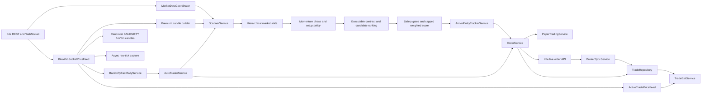

# Current Architecture

## Purpose and authority

This document describes how the Bank Nifty option-buying application works now. It is the canonical architecture overview for the repository.

- Read this document before changing service boundaries, runtime wiring, market-data handling, persistence, or broker integration.
- Use [TRADING_FLOW.md](TRADING_FLOW.md) for the entry and exit sequence.
- Use [DECISIONS.md](DECISIONS.md) for the reasons behind important design choices.
- Root-level audit and map files are useful historical reports, but they are not the source of truth when they disagree with these documents or the current code.

The application is a modular monolith: one FastAPI process composes the providers, services, repositories, background workers, WebSocket callbacks, and HTTP endpoints. `app/api.py` is the composition root.

## Scope and safety boundary

The executable trading scope is intentionally narrow:

- Underlying: `BANKNIFTY` / `NIFTY BANK`.
- Instruments: NSE/NFO Bank Nifty options.
- Entries: option buying only (`BUY_CE` and `BUY_PE`).
- Expiry and instrument tokens: resolved from live broker instrument data; they must not be hardcoded.
- Default order mode: paper.
- Armed WebSocket entry: paper-only in the current implementation.
- Live order routing: available only through `OrderService` when live configuration, explicit confirmation, execution-quality checks, broker reconciliation, funds, and risk checks all pass.

## System map

## Runtime composition

`app/api.py` creates shared runtime objects rather than letting each request build an independent trading system. Important shared objects include:

| Component | Responsibility |
|---|---|
| `KiteProvider` / `KiteFeed` | Broker REST access, instruments, quotes, historical data, margins, and orders. |
| `MarketDataCoordinator` | Coordinates and caches broker market-data requests. |
| `KiteWebSocketPriceFeed` | Tick ingestion, ownership-based subscriptions, priority event delivery, gap reporting, and premium candle construction. |
| `UnderlyingCandleService` | Builds exchange-timestamped, current-session canonical `BANKNIFTY` 1-minute candles and completed 5-minute aggregates without lookahead. |
| `RawTickCaptureService` / `TickReplayService` | Asynchronously retain replay-relevant ordered ticks and replay them by capture sequence. |
| `FastScanContextService` | Holds a bounded-age immutable snapshot of slow evidence for fast candidate promotion and rejects stale/config-mismatched contexts. |
| `LatencyMetricsService` | Keeps bounded latency samples, tail percentiles, queue drops, last events, and strategy/config lineage. |
| `BankNiftyIntelligenceService` | Loads a locally versioned official NSE Indices 14-member weight snapshot, measures available weight coverage, and keeps stale or incomplete constituent evidence from creating false confidence. |
| `ExecutablePriceService` | Converts long-option bid depth into a conservative quantity-aware sell price and classifies whether the quote is safe for paper targets or live software exits. |
| `BankNiftyOptionPrewarmService` | Keeps the nearest-expiry ATM ± configured strike depth CE/PE band warm. The current default depth is 3. |
| `BankNiftyFastRallyService` | Detects short-window Bank Nifty acceleration and requests an immediate scan. |
| `AutoTraderService` | Runs scheduled scans, serialized fast rescans, optional order routing, and duplicate live-order protection. |
| `ScannerService` | Builds and evaluates Bank Nifty opportunities, records accepted/rejected outcomes, and registers early armed setups. |
| `MultiTimeframeContextService` | Assigns daily/30m/15m/5m/1m evidence to structure, bias, session character, regime, and trigger responsibilities; ticks remain execution-only. |
| `MarketRegimeService` | Classifies structure, volatility, participation, location, and execution into a confidence/uncertainty-aware option-buying regime with invalidation. |
| `MomentumPhaseService` / `SetupFamilyClassifierService` | Separates formation, acceleration, breakout, confirmation, continuation, exhaustion and failure, then applies a regime-specific setup/exit policy. |
| `TradeCandidateRankingService` | Orders candidates using reward/risk, spread, costs, liquidity, uncertainty and policy quality without mislabeling utility as probability. |
| `TradeSetupService` | Resolves expiry, ranks executable contracts using ask/bid, spread, depth, OI, volume, Greeks/DTE when available, applies stickiness, and builds premium-based SL/targets/quantity. |
| `ArmedEntryTrackerService` | Persists and recovers selected option setups, reports subscription health truthfully, tracks ticks, and executes confirmed paper entries. |
| `OrderService` | Validates scanner-originated Bank Nifty option-buying signals and routes them to paper or explicitly authorized live execution. |
| `RiskManagementService` | Enforces account-level daily loss, trade count, stop count, cooldown, open-trade, and exposure limits. |
| `ActiveTradePriceFeed` | Uses fresh WebSocket ticks first and controlled broker polling fallback for active trades. |
| `TradeExitService` | Evaluates deterministic stop/time/trailing/invalidation/target priority against executable bid/depth, records simultaneous triggers, and performs paper/live square-off. |
| `BrokerSyncService` | Reconciles local live trades, broker positions, entry/exit orders, and protective disaster stops; protection failures persistently block new live entries. |
| `EvidenceMatrixService` / `StrategyPromotionService` | Segment independent outcomes and make manual, non-self-modifying promotion recommendations. |
| Repository services | Persist candles, opportunities, rejections, armed entries, trades, strategy versions, validations, and runtime jobs. |

The shared `TradeSetupService` is deliberate: its in-memory Bank Nifty contract stickiness must survive across scanner instances created for separate requests or scans.

## Startup and shutdown

At application startup:

1. Strategy-version registration, valid armed-entry recovery, old WebSocket candle cleanup, and raw-tick retention cleanup run in background maintenance.
2. Broker order/trade synchronization and startup position reconciliation run separately.
3. If WebSocket support is enabled, the market-data runtime starts.
4. The `NIFTY BANK` instrument token is resolved from the broker's current NSE instrument list.
5. That underlying token is assigned to the fast-rally detector and canonical candle builder, mapped to `BANKNIFTY`, and subscribed under the `core_market` owner.
6. If the market is open, an initial scanner refresh is requested.
7. If automation is configured, the automation supervisor starts its market-hours lifecycle.

Shutdown stops the market-data runtime, canonical candle and raw-tick writers, automation supervisor, snapshot collector, auto trader, and outcome monitor.

## WebSocket subscription model

Subscriptions are owner-based. A token remains subscribed while at least one owner still needs it, preventing one subsystem from accidentally unsubscribing another.

| Owner | Typical mode | Purpose |
|---|---|---|
| `core_market` | `quote` | Bank Nifty underlying ticks for acceleration detection. |
| `banknifty_prewarm` | `quote` | Near-ATM CE/PE band used for warm prices and candle context. |
| `armed:<setup_id>` | `full` | Bid, ask, volume, and price confirmation for one armed setup. |
| `active_trade` | `full` | Fresh prices for open-position monitoring and exits. |

The effective token mode is the highest mode requested by any owner. Band rotation subscribes the new ATM band first and retires the old band after an overlap lease. Rotation hysteresis avoids needless churn around the ATM boundary.

The event queue prioritizes:

1. Broker order updates.
2. Data-gap events.
3. Armed-entry and active-trade ticks.
4. Ordinary warm-market ticks.

Order execution is moved off the WebSocket callback path so a broker/database operation does not stall tick ingestion.

An armed setup is operational only when its subscription is broker-requested or fresh-tick verified. Disconnected subscriptions are explicitly queued; subscription failures cancel registration instead of displaying a false armed state. Valid setup payloads are stored in `armed_entries`, rehydrated after restart, and resubscribed under the original owner.

## Decision hierarchy

The scanner keeps safety gates, weighted evidence, and policy suitability separate. Daily/30-minute candles establish structure and bias, 15-minute candles describe the session, 5-minute candles classify the tradable regime, 1-minute candles form the trigger, and ticks confirm executable entry/exit. Missing higher-timeframe evidence increases uncertainty; lower-timeframe momentum cannot substitute for it.

Market state reports structure, volatility, participation, location and execution dimensions plus regime, confidence, uncertainty, option-buying suitability, abstention and invalidation. Momentum is classified as formation, acceleration, breakout, confirmation, continuation, exhaustion or failure. Setup families own distinct entry/invalidation/exit policies. Candidate utility remains an after-cost ordering tool until independent outcomes can calibrate probability and expectancy.

## Tick and premium-candle handling

Each normalized `WebSocketTick` carries the instrument token, last price, exchange/receive timestamp, cumulative volume when available, bid, ask, five-level depth and quantities when available, timestamp source, and packet type.

The premium candle builder:

- Converts cumulative day volume into positive per-tick increments before adding it to a candle.
- Builds one-minute OHLCV candles by token.
- Inserts flat, zero-volume continuity candles for missing minutes.
- Can persist and rehydrate recent WebSocket-built candles.
- Can recover historical context without pretending recovered candles were live ticks.
- Keeps live-token verification separate from merely requesting a subscription; `is_live_verified()` requires a fresh received tick.

The underlying candle path is separate from option-premium candles. It accepts only broker exchange/last-trade timestamps inside the configured NSE session, persists completed `1minute` candles, aggregates only completed minutes into `5minute`, marks generated in-session continuity rows, and recovers persisted state without replaying it as live ticks. `KiteFeed` combines a fresh exchange-timestamped LTP with these completed candles; broad context quotes use a separate cache and cannot masquerade as indicator evidence.

Raw ticks for `core_market`, `banknifty_prewarm`, `armed:*`, and `active_trade` owners enter a bounded asynchronous writer. Persisted records include depth, both timestamps, sequence, owners, and strategy/config lineage. Warm ticks may be evicted under pressure, but an armed/active tick loss raises critical capture status. Retention is configurable and replay uses persisted capture sequence while exposing sequence gaps.

Historical bootstrap is explicit and broker-backed: `POST /data/ingest/banknifty-canonical-bootstrap` requests canonical `BANKNIFTY` `1minute` and `5minute` history, stores only completed regular-session candles with exchange timestamps, and skips duplicates. It never fabricates gaps or treats option/`WS_TOKEN:*` candles as underlying history.

## Constituent intelligence

`app/data/banknifty_constituents_2026-06-30.json` is the reviewed hot-path authority for the 14-member Nifty Bank snapshot. It records the official source/effective date, exact weights and strategy lineage. The refresh script accepts a separately downloaded official NSE Indices sector payload, validates membership and total weight, and refuses an unreviewed constituent change. Staleness is visible and removes hard-gate authority; available-data coverage is calculated by official index weight, with a defensive per-bank hard-gate cap so a few observations cannot dominate.

## Exit execution model

For a long option, LTP is diagnostic only. A full quantity-covered five-level bid book produces a depth-weighted executable sell price. Partial depth uses the worst visible bid conservatively but cannot prove a target fill or authorize a live software exit. A best bid without quantity may support paper execution but is live-unsafe; LTP alone never fills a target or exit. Stored exit evidence includes LTP, best bid/ask, executable price, coverage, spread, source, quote time, first rule and all simultaneous rules.

Exit priority is deterministic: stop, time/near-close, trailing, underlying/premium invalidation, then targets. Optional invalidation and partial-booking behavior remains configuration-controlled and must earn out-of-sample support; the exit-rule ablation report explicitly reports when counterfactual paths are unavailable.

Time-stop duration, trailing activation and target style come from the persisted setup-family exit profile. No profile may weaken the original hard stop.

## Latency measurement

The in-memory latency report always exposes the required path metrics even with zero samples: exchange-to-receive, receive-to-rally detection, detection-to-scan, scheduled and fast scan durations, scan-to-arm, arm-to-confirmation, confirmation-to-submission, submission-to-acknowledgement, acknowledgement-to-fill, and exit trigger-to-submission/acknowledgement/fill. Every metric reports p50/p95/p99, sample count and missing count; queue drop totals are separate. Broker/database consumers are queued off the WebSocket event callback, while latency recording is bounded in-memory work.

## Gap semantics

Not every absence of ticks means the feed is broken:

- A long interval between ticks for one option is recorded as token inactivity. It is diagnostic-only and does not cancel an armed trade.
- A connection-level WebSocket gap is entry-blocking while active.
- A recovered gap is non-blocking.
- Token-scoped blocking events affect only setups for the relevant token; connection-scoped events may affect every armed setup.

These semantics prevent illiquid or temporarily quiet contracts from cancelling unrelated opportunities while still protecting entries during genuine feed loss.

## Persistence and operational records

The database layer stores, among other records:

- Market and option candles.
- Option quote snapshots.
- Signals and accepted opportunities.
- Rejected opportunities with structured reasons.
- Paper/live trade lifecycle records.
- Strategy versions and validation results.
- Raw ticks and independent setup episodes.
- Runtime job history.
- Durable armed-entry lifecycle payloads and states.

Accepted and rejected opportunities must remain explainable. A hard-gate rejection, armed-entry expiry, chase rejection, data-gap cancellation, or order failure should retain its reason in repository records and diagnostics.

Opportunities, rejection observations/episodes, validations, trades, raw replays, and latency events carry strategy version and config hash. Mixed hashes are surfaced and block professional readiness; paper mode may continue visibly, while direct live routing fails closed on unregistered drift.

## Configuration authority

`app/config.py` defines environment-backed settings. `.env.example` is the checked-in configuration reference; `.env` is machine-specific runtime configuration and must not be treated as documentation.

Safety-sensitive defaults include:

- `ORDER_MODE=paper`
- `ENABLE_EVENT_DRIVEN_PAPER_ENTRY=true`
- `ENABLE_EVENT_DRIVEN_LIVE_ENTRY=false`
- `ENABLE_DIRECTIONAL_ROOM_HARD_GATE=false`
- `BANKNIFTY_PREWARM_STRIKE_DEPTH=3`
- `ARMED_ENTRY_VALID_SECONDS=90`
- `FAST_RALLY_WINDOW_SECONDS=5.0`
- `FAST_RALLY_TRIGGER_PCT=0.08`
- `STRATEGY_VERSION=banknifty_option_buying_v4`
- `ENABLE_HIERARCHICAL_MARKET_STATE=true`
- `ARMED_ENTRY_RECOVERY_ENABLED=true`
- `REQUIRE_BROKER_PROTECTIVE_STOP_FOR_LIVE_ENTRY=true`
- `ENABLE_BROKER_EMERGENCY_SL=false`

The last two defaults deliberately block live entry until broker-side protection is explicitly enabled and verified. Even after that, live routing remains subject to paper/live mode flags, confirmation, strategy registration/config drift, reconciliation, funds, execution quality and account risk.

Changing a default is a behavior change and requires tests plus updates to this document, [TRADING_FLOW.md](TRADING_FLOW.md), or [DECISIONS.md](DECISIONS.md) as applicable.

## Operational inspection

Use these endpoints to understand the running system:

| Endpoint | Purpose |
|---|---|
| `GET /runtime/status` | High-level runtime status. |
| `GET /runtime/latency` | p50/p95/p99/max/sample and last-event latency detail with queue drops. |
| `GET /market-data/pipeline-status` | Canonical candle coverage, raw-tick capture, fast context, WebSocket queues, and latency. |
| `GET /automation/status` | Automation lifecycle and worker status. |
| `GET /kite/websocket/status` | Connection, owners, subscriptions, queue, gaps, candles, and fast-rally status. |
| `GET /scanner/opportunities` | Accepted scanner opportunities. |
| `GET /scanner/diagnostics` | Gate, score, contract, and rejection explanations. |
| `GET /scanner/armed-entries` | Armed, pending, entered, expired, too-late, and cancelled setup states. |
| `GET /research/evidence-matrix` | Version-separated setup/regime outcome cells; rejections never enter trade expectancy. |
| `GET /research/strategy-promotion` | Advisory promotion checks; never mutates live settings. |
| `GET /research/professional-readiness` | Non-blocking cached readiness from the after-market research lane. |
| `GET /risk/status` | Account-level entry risk and reconciliation state. |
| `GET /trades` | Persisted paper/live trade lifecycle records. |
| `GET /trades/exit-alerts` | Stuck or mismatched live exits. |
| `GET /broker/reconciliation/status` | Broker/local mismatch and live-trading block status. |

## Maintenance checklist

When architecture changes, update the documentation in the same change:

1. Update this file for components, ownership, runtime wiring, storage, or configuration boundaries.
2. Update [TRADING_FLOW.md](TRADING_FLOW.md) for gates, scoring, states, entry, order, or exit behavior.
3. Add or amend a record in [DECISIONS.md](DECISIONS.md) when the rationale or trade-off changes.
4. Update `.env.example` when a setting is added or renamed.
5. Add tests for trading-logic changes and run the relevant focused and full suites.
