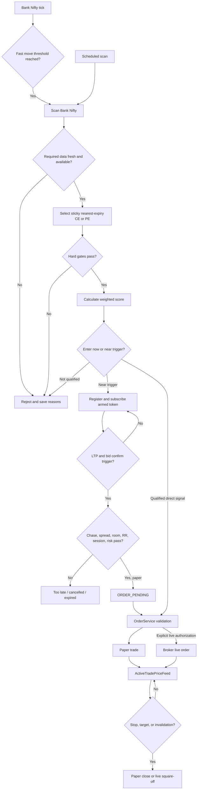

# Trading Flow

## Purpose

This document is the canonical description of how the application finds, arms, enters, and exits Bank Nifty option-buying trades.

The system has two entry paths:

1. **Armed WebSocket entry:** reacts to option ticks and currently places paper trades only.
2. **Direct order routing:** manual or automation-created scanner signals pass through `OrderService`; live routing is possible only with explicit live authorization and all safety gates.

Neither path bypasses risk management.

## End-to-end flow

## 1. Keep likely contracts warm

Before a setup is selected, `BankNiftyOptionPrewarmService` resolves the nearest live expiry and the current ATM strike from broker instruments. It subscribes the ATM ± configured strike depth for both CE and PE. The current default depth is three strikes on each side.

The prewarm band uses quote mode. When ATM changes, the system:

1. Applies hysteresis so small boundary movements do not rotate the band repeatedly.
2. Subscribes the new band.
3. Keeps the old band for a configured overlap period.
4. Releases only tokens no longer owned by any subsystem.

This means option ticks and premium candles are usually available before the scanner chooses a contract.

## 2. Start a scan

A scan can begin from:

- The scheduled `AutoTraderService` loop.
- A manual scanner endpoint.
- Startup warmup while the market is open.
- A Bank Nifty fast-rally event.

`BankNiftyFastRallyService` observes only the broker-resolved Bank Nifty underlying token. With current defaults, a move of at least 0.08% in either direction within five seconds promotes only `BANKNIFTY` for full candidate validation. A cooldown, shared scan lock, duplicate-order protection, and a bounded-age `FastScanContextService` prevent overlapping or stale-context decisions.

The fast-rally event is stage A only. Stage B uses the same scanner gates, scoring, contract selection, entry timing, chase, quality, reconciliation, and account risk primitives as scheduled scans. Missing, stale, or config-mismatched slow context rejects the promotion. It never authorizes live event entry.

## 3. Build the candidate

The scanner gathers Bank Nifty market context, price action, regime, option chain, option quotes, premium candles, option quality, volatility context, time-bucket evidence, and learned/validated strategy context.

`TradeSetupService` then:

1. Resolves the nearest valid expiry from live instruments.
2. Maps bullish setups to CE and bearish setups to PE for option buying.
3. Builds contracts from the matching expiry and option type.
4. Scores liquidity, price, spread, OI, volume, strike distance, and affordability where applicable.
5. Selects the best contract.
6. Applies Bank Nifty contract stickiness.

For the configured stickiness window, the selected token remains pinned unless it becomes unsafe or a replacement exceeds it by the configured score advantage. This prevents strike oscillation between consecutive scans.

## 4. Apply hard gates and weighted scoring

Hard gates and confidence evidence are separate.

### Hard gates

Hard gates are reserved for conditions that make an entry unsafe, unavailable, or untradable, such as:

- Missing or stale required market data.
- Missing/invalid option contract or executable premium.
- Expired or blocked expiry-day contract.
- Unacceptable option liquidity or spread.
- Invalid quantity, stop, target, or risk/reward construction.
- Account risk-limit failure.
- Closed market for event-driven execution.
- Broker/local reconciliation mismatch for live execution.

### Weighted evidence

Trend, momentum, volume, price action, breakout structure, regime, Bank Nifty context, option-chain context, PCR, max pain, nearest levels, expected move, and related evidence contribute to a weighted score unless testing justifies a hard safety gate.

Correlated trend and momentum evidence is capped so several versions of the same observation do not create false confidence. Nearest-level and expected-move evidence is breakout-aware: a confirmed breakout can reduce their negative weight rather than being rejected automatically. `ENABLE_DIRECTIONAL_ROOM_HARD_GATE` remains false by default.

Every accepted and rejected candidate should be logged with its reasons and score components.

## 5. Decide whether to arm

An early setup may be armed when:

- Early arming is enabled for the requested mode.
- Its score meets `EARLY_ARM_MIN_SCORE`.
- Required data-quality, freshness, option-quality, market-regime, and price-action factors pass.
- The contract, trigger, premium, SL, targets, and quantity are valid.
- The account-level risk preflight passes.
- `ArmedEntryTrackerService.register_from_scan()` actually returns `registered=true`.

The scanner reports `ARMED_FOR_ENTRY` only after successful registration. A promising setup that failed registration must retain the rejection/pending reason and must not display a false armed state.

The default armed lifetime is 90 seconds. Repeated scans for the same mode, action, token, expiry, and strike update the logical setup rather than creating uncontrolled duplicates.

## 6. Armed-entry state machine

| State | Meaning | Possible next states |
|---|---|---|
| `ARMED_FOR_ENTRY` | Registered and waiting for a valid option breakout. | `ORDER_PENDING`, `ENTER_NOW`, `TOO_LATE`, `EXPIRED`, `CANCELLED` |
| `ENTER_NOW` | Confirmation passed and the paper entry function is executing. | `ENTERED_PAPER`, `CANCELLED` |
| `ORDER_PENDING` | Execution has been queued off the WebSocket callback thread. | `ENTER_NOW`, `ENTERED_PAPER`, `CANCELLED` |
| `ENTERED_PAPER` | Paper trade was created and persisted. | Terminal for the armed setup; trade lifecycle continues separately. |
| `TOO_LATE` | Premium chase, remaining reward, spread, or target room became unsafe. | Terminal |
| `EXPIRED` | The armed validity window elapsed. | Terminal |
| `CANCELLED` | Session, risk, feed, mode, or execution safety failed. | Terminal |

The armed subscription owner is `armed:<setup_id>` in full mode. It is released when the setup enters or reaches a terminal rejection state. Other owners may keep the same token subscribed.

## 7. Confirm the option breakout

For every tick belonging to an active armed setup:

1. Use the ask, or last price when ask is unavailable, as the executable entry estimate.
2. Use `min(last price, bid)` as the confirmation price.
3. Require that confirmation price to reach the stored trigger.
4. Require tick-quality confirmation: enough above-trigger ticks, hold time, bid behavior, and stable spread.

A lone LTP spike is therefore insufficient when the bid does not support it. Under ordinary flow the default confirmation uses at least two ticks and a one-second hold. During dense movement, four qualifying ticks allow the hold to reduce to 0.25 seconds.

## 8. Recheck entry safety at the trigger

As soon as the executable price reaches the trigger, the tracker checks whether the opportunity is already too late. It evaluates:

- Normalized premium chase using recent observed range and spread scale.
- Remaining room to target 1.
- Remaining reward-to-risk after using the current executable price.
- Current bid/ask spread.
- Armed setup expiry.

After tick confirmation it also checks:

- Regular market session.
- Supported order mode.
- Event-entry feature flags.
- A fresh account-level risk evaluation.

Failure becomes `TOO_LATE` or `CANCELLED`, is logged, and releases only the armed owner's subscription.

## 9. Execute the entry

### Armed WebSocket path

The current `ArmedEntryTrackerService` is explicitly paper-only. A live-mode armed setup remains blocked with `live_trading_not_enabled_for_event_entry`, even if it receives qualifying ticks. A confirmed paper setup is moved to `ORDER_PENDING` when the live WebSocket worker is running, then executed on a dedicated single-worker executor.

The resulting signal is passed through `OrderService` with event metadata and persisted as a filled paper trade. The active option token is then owned by `active_trade` for exit monitoring.

### Direct manual or automation path

`OrderService` independently validates that a signal:

- Is a Bank Nifty NFO option.
- Is option buying only (`BUY_CE` or `BUY_PE`).
- Has valid quantity, entry, stop, target, score, expiry, and scanner strategy metadata.
- Passes execution-quality checks.

Without explicit live confirmation, the order is routed to paper even if `order_mode=live` was requested. Live execution additionally requires:

- `LIVE_TRADING_MODE=true`.
- `PAPER_TRADING_MODE=false`.
- `confirm_live=true`.
- Broker/local reconciliation not blocked.
- Account risk checks passing.
- Funds sufficient for at least one lot.

Only then can `OrderService` send a broker market order and persist the live trade record.

## 10. Monitor and exit

Open option tokens are subscribed under the `active_trade` owner in full mode. `ActiveTradePriceFeed` prefers fresh WebSocket ticks. For live trades, stale or disconnected WebSocket data blocks unsafe decisions unless the configured broker polling fallback obtains an acceptable price.

`TradeExitService` evaluates open trades for:

- Stop-loss crossing.
- Target achievement.
- Configured underlying or premium invalidation.
- Optional partial booking and move-to-cost behavior.
- Broker protective-stop state where configured.

Paper exits close the virtual position and trade record. Live exits require live auto-square-off to be enabled, submit the broker exit, and use broker updates/reconciliation to confirm lifecycle state. Exit failures and reconciliation mismatches remain visible rather than being silently marked closed.

## 11. Feed failures and recovery

- One quiet token produces a diagnostic token-inactivity event; it does not cancel armed entries.
- A true connection gap is entry-blocking until recovery.
- Recovered/non-blocking gap events do not cancel setups.
- A token-scoped blocking event cancels only setups for that token.
- A connection-scoped blocking event can cancel all active armed setups when configured.
- Subscription ownership prevents prewarm, armed, and active-trade consumers from removing each other's tokens.

## 12. Replay and calibration

`TickReplayService` replays ad-hoc ticks deterministically and replays persisted sessions by their capture sequence without sleeping. Raw records include price, bid/ask, cumulative volume, exchange/receive timestamps, provenance, packet type, owners, and strategy/config lineage.

Rejected-opportunity evaluation uses raw-tick first touch, then chronological candles. It never infers a hit from a later current quote. Same-candle stop/target paths stay ambiguous; incomplete paths are censored and excluded from learning. Repeated observations share a setup episode, so research counts independent episodes rather than scanner frequency.

Research/backtests do not run from scheduled scans, fast callbacks, or order paths. Time-bucket evidence is precomputed after market hours, versioned by strategy/config, and rejected when missing, stale, or mismatched. Walk-forward validation uses multiple anchored folds with a purge/embargo at least as large as the trade horizon. Readiness requires at least the configured fold, independent out-of-sample trade, and session counts; zero-trade evidence cannot pass.

Until a chronological out-of-sample calibration model has sufficient independent samples, API `probability` is `null`. The numeric score-derived value is exposed only as `heuristic_score_confidence` with an explicit source.
