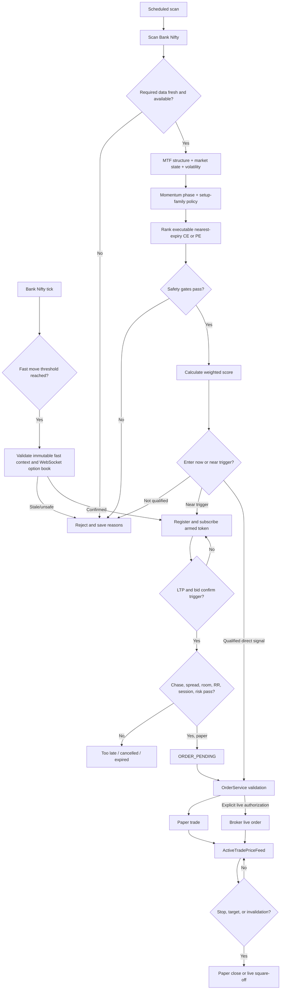

# Trading Flow

## Purpose

This document is the canonical description of how the application finds, arms, enters, and exits Bank Nifty option-buying trades.

The system has two entry paths:

1. **Armed WebSocket entry:** reacts to option ticks and currently places paper trades only.
2. **Direct order routing:** manual or automation-created scanner signals pass through `OrderService`; live routing is possible only with explicit live authorization and all safety gates.

Neither path bypasses risk management.

## End-to-end flow

## 1. Keep likely contracts warm

Before a setup is selected, `BankNiftyOptionPrewarmService` resolves the nearest live expiry and the current ATM strike from broker instruments. It subscribes the ATM ± configured strike depth for both CE and PE. The current default depth is three strikes on each side.

The prewarm band uses quote mode. When ATM changes, the system:

1. Applies hysteresis so small boundary movements do not rotate the band repeatedly.
2. Subscribes the new band.
3. Keeps the old band for a configured overlap period.
4. Releases only tokens no longer owned by any subsystem.

This means option ticks and premium candles are usually available before the scanner chooses a contract.

## 2. Start a scan

A scan can begin from:

- The scheduled `AutoTraderService` loop.
- A manual scanner endpoint.
- Startup warmup while the market is open.
- A Bank Nifty fast-rally event.

`BankNiftyFastRallyService` observes only the broker-resolved Bank Nifty underlying token. With current defaults, a move of at least 0.08% in either direction within five seconds requests one serialized cached validation. It does not instantiate or rerun `ScannerService`.

The fast validator reads immutable completed 1m/5m context, a complete precomputed paper plan, and the latest in-memory prewarmed option tick/depth. It normally performs zero REST calls, database reads, database writes, backfill, margins lookup and instrument downloads. Missing/stale/config-mismatched context, disconnected/gapped WebSocket state or stale/non-executable quotes reject without synchronous fallback. A passing result promotes the plan into the existing durable armed-entry path outside the validation budget. Registration reruns account risk, persists the setup and acquires the option subscription; it does not place an order directly and never authorizes live event entry.

Every threshold crossing records whether cached validation was queued or suppressed. Suppression reasons include a stopped auto trader, validation already running, cooldown, and dispatch failure. The completed validation records its gate reason and measured I/O; any REST or database call converts the result to `fast_candidate_io_budget_exceeded`. Below-threshold ticks are summarized in status with their threshold progress rather than flooding the decision feed.

## 3. Build the candidate

The scanner first requires a fresh Bank Nifty LTP. Until 09:45 IST, the opening setup requires five completed 1-minute and three completed 5-minute candles; after that, both frames require six completed candles by default. It derives bullish, bearish or neutral structure from swing progression, impulse breadth, pullback retention and breakout acceptance. A neutral result abstains; one candle never chooses CE or PE. EMA, MACD, RSI and ADX may be calculated after enough history exists, but they are diagnostic-only and cannot delay readiness or choose direction.

It then gathers Bank Nifty market context, price action, regime, option chain, option quotes, premium candles, option quality, volatility context, time-bucket evidence, and learned/validated strategy context. Constituent participation uses the reviewed official 14-member local snapshot: availability is measured by official weight, hard-gate influence is capped per bank, and stale/incomplete coverage cannot claim reliable alignment.

`TradeSetupService` then:

1. Resolves the nearest valid expiry from live instruments, skipping same-day expiry when expiry-day buying is blocked and selecting the next listed expiry.
2. Maps bullish setups to CE and bearish setups to PE for option buying.
3. Builds contracts from the matching expiry and option type.
4. Ranks executable ask/bid, spread, top-book depth, OI, volume, strike distance, preferred DTE, closeness to target delta, theta when supplied, and affordability where applicable.
5. Selects the best contract.
6. Applies Bank Nifty contract stickiness.

For the configured stickiness window, the selected token remains pinned unless it becomes unsafe or a replacement exceeds it by the configured score advantage. This prevents strike oscillation between consecutive scans.

## 4. Apply hard gates and weighted scoring

Hard gates and confidence evidence are separate.

### Primary hard gates

Hard gates are reserved for conditions that make an entry unsafe, unavailable, or untradable, such as:

- Market session, data freshness, WebSocket health and data-gap safety.
- Completed 1-minute and 5-minute directional agreement.
- Reliable Bank Nifty constituent participation.
- Selected-option premium participation.
- Executable bid/ask spread, depth, liquidity and quote freshness.
- Chase protection and sufficient remaining risk/reward.
- Account risk limits and live broker/reconciliation protection.

### Candidate ranking and shadow evidence

Weighted scoring ranks candidates only after primary gates pass. It does not approve an unsafe candidate or veto a safe candidate by itself. A scanner signal carries current-version `primary_gates_passed` provenance, allowing signal creation and order validation below the legacy `MIN_SIGNAL_SCORE`; signals without that exact provenance still face the legacy score guard. Hierarchical state, momentum phase, setup-family score adjustment, candidate utility, volatility/learned edge and duplicate regime scores are recorded as shadow diagnostics and have zero active adjustment or gate authority.

Every accepted and rejected candidate should be logged with its reasons and score components.

Before final timing, one bulk read supplies completed 1m/5m state. Five-minute data defines setup direction, regime, day/opening structure and candle confirmation; one-minute data defines entry timing. Tick data confirms execution. No daily, 15-minute or 30-minute candle participates in live or historical decisions.

The setup family supplies allowed regimes, momentum phases and an exit profile. Its score adjustment is capped. Candidate ranking applies spread and conservative costs, reward/risk, liquidity and uncertainty. Until calibrated evidence exists, ranking utility is neither expected profit nor probability.

## 5. Decide whether to arm

An early setup may be armed when:

- Early arming is enabled for the requested mode.
- Required data-quality, freshness, option-quality, market-regime, and price-action factors pass.
- The contract, trigger, premium, SL, targets, and quantity are valid.
- The account-level risk preflight passes.
- `ArmedEntryTrackerService.register_from_scan()` actually returns `registered=true`.

The scanner reports `ARMED_FOR_ENTRY` only after successful registration. `subscription_state` distinguishes fresh-tick verification, broker subscription awaiting its first fresh tick, and a disconnected queued subscription. A subscription failure cancels registration. Valid setups are persisted and recovered with their owner subscription after restart.

The default armed lifetime is 90 seconds. Repeated scans for the same mode, action, token, expiry, and strike update the logical setup rather than creating uncontrolled duplicates.

## 6. Armed-entry state machine

| State | Meaning | Possible next states |
|---|---|---|
| `ARMED_FOR_ENTRY` | Registered and waiting for a valid option breakout. | `ORDER_PENDING`, `ENTER_NOW`, `TOO_LATE`, `EXPIRED`, `CANCELLED` |
| `ENTER_NOW` | Confirmation passed and the paper entry function is executing. | `ENTERED_PAPER`, `CANCELLED` |
| `ORDER_PENDING` | Execution has been queued off the WebSocket callback thread. | `ENTER_NOW`, `ENTERED_PAPER`, `CANCELLED` |
| `ENTERED_PAPER` | Paper trade was created and persisted. | Terminal for the armed setup; trade lifecycle continues separately. |
| `TOO_LATE` | Premium chase, remaining reward, spread, or target room became unsafe. | Terminal |
| `EXPIRED` | The armed validity window elapsed. | Terminal |
| `CANCELLED` | Session, risk, feed, mode, or execution safety failed. | Terminal |

The armed subscription owner is `armed:<setup_id>` in full mode. It is released when the setup enters or reaches a terminal rejection state. Other owners may keep the same token subscribed.

## 7. Confirm the option breakout

For every tick belonging to an active armed setup:

1. Use the ask, or last price when ask is unavailable, as the executable entry estimate.
2. Use `min(last price, bid)` as the confirmation price.
3. Require that confirmation price to reach the stored trigger.
4. Require tick-quality confirmation: enough above-trigger ticks, hold time, bid behavior, and stable spread.

A lone LTP spike is therefore insufficient when the bid does not support it. Under ordinary flow the default confirmation uses at least two ticks and a one-second hold. During dense movement, four qualifying ticks allow the hold to reduce to 0.25 seconds.

## 8. Recheck entry safety at the trigger

As soon as the executable price reaches the trigger, the tracker checks whether the opportunity is already too late. It evaluates:

- The same normalized opportunity model used by scheduled and fast validation, using pre-trigger observed range, option-volatility scale and spread scale.
- Remaining room to target 1.
- Remaining reward-to-risk after using the current executable price.
- Current bid/ask spread.
- Breakout-aware expected-move and nearby-level context without bypassing numerical remaining-opportunity checks.
- Armed setup expiry.

After tick confirmation it also checks:

- Regular market session.
- Supported order mode.
- Event-entry feature flags.
- A fresh account-level risk evaluation.

Failure becomes `TOO_LATE` or `CANCELLED`, is logged, and releases only the armed owner's subscription.

## 9. Execute the entry

### Armed WebSocket path

The current `ArmedEntryTrackerService` is explicitly paper-only. A live-mode armed setup remains blocked with `live_trading_not_enabled_for_event_entry`, even if it receives qualifying ticks. A confirmed paper setup is moved to `ORDER_PENDING` when the live WebSocket worker is running, then executed on a dedicated single-worker executor.

The resulting signal is passed through `OrderService` with event metadata and persisted as a filled paper trade. The active option token is then owned by `active_trade` for exit monitoring.

### Direct manual or automation path

`OrderService` independently validates that a signal:

- Is a Bank Nifty NFO option.
- Is option buying only (`BUY_CE` or `BUY_PE`).
- Has valid quantity, entry, stop, target, expiry, and scanner strategy metadata. A below-legacy-threshold score additionally requires current-version proof that scanner primary gates passed and score was ranking-only.
- Passes execution-quality checks.

Without explicit live confirmation, the order is routed to paper even if `order_mode=live` was requested. Live execution additionally requires:

- `LIVE_TRADING_MODE=true`.
- `PAPER_TRADING_MODE=false`.
- `confirm_live=true`.
- Broker/local reconciliation not blocked.
- Account risk checks passing.
- Funds sufficient for at least one lot.

Only then can `OrderService` send a broker market order and persist the live trade record.

For a confirmed live fill, broker-side disaster protection is mandatory. A complete fill receives an SL-M sell order for the filled quantity. If the entry is partial, the remaining entry quantity is cancelled before protecting only the actual fill. Missing acknowledgement/order ID, rejection, cancellation or placement failure marks protection failed and blocks subsequent live entries. Broker postbacks and REST reconciliation maintain the protection state.

## 10. Monitor and exit

Open option tokens are subscribed under the `active_trade` owner in full mode. `ActiveTradePriceFeed` prefers fresh WebSocket ticks. For live trades, stale or disconnected WebSocket data blocks unsafe decisions unless the configured broker polling fallback obtains an acceptable price.

Before rule evaluation, `ExecutablePriceService` calculates the sell price available for the remaining quantity. Full five-level bid depth produces a conservative depth-weighted price. Partial depth uses the worst visible bid but cannot prove a target or authorize a live software exit. Best-bid-only data is paper-only; LTP-only data is diagnostic and cannot fill an exit.

`TradeExitService` reads the persisted setup-family exit profile and then evaluates open trades in explicit priority order:

- Stop-loss crossing.
- Near-close/setup-sensitive time stop, with a longer duration only for trend/expansion runners.
- Premium high-watermark trailing stop using option ATR and an original-risk floor.
- Configured underlying or premium invalidation.
- One whole-lot partial at the profile's R multiple when at least two lots exist, then targets and a whole-lot runner.
- Broker protective-stop coordination.

The profile may change time-stop duration, trend-runner extension, partial/trailing activation in R units and target style. A partial can move the software runner boundary to cost, but the original hard stop remains authoritative. Live partial booking stays disabled until fill-confirmation handling is implemented and validated.

Paper exits use the same executable-price assumptions and close the virtual position/trade record. Live exits require full quantity-safe executable depth and live auto-square-off, cancel a non-triggered protective order when appropriate, submit one broker exit, and use broker updates/reconciliation to confirm lifecycle state. Exit failures and mismatches remain visible rather than being silently marked closed. LTP, book evidence, first rule and all simultaneous triggers are persisted for audit and analytics.

## 11. Feed failures and recovery

- One quiet token produces a diagnostic token-inactivity event; it does not cancel armed entries.
- A true connection gap is entry-blocking until recovery.
- A reconnect attempt alone is not recovery. The gate clears only after the broker connection callback or a verified fresh regular-market tick.
- A verified fresh tick self-heals `connected` state if the SDK omitted its connection callback, and emits one recovered-gap event.
- Recovered/non-blocking gap events do not cancel setups.
- A token-scoped blocking event cancels only setups for that token.
- A connection-scoped blocking event can cancel all active armed setups when configured.
- Subscription ownership prevents prewarm, armed, and active-trade consumers from removing each other's tokens.
- Ordinary unclean disconnects are reconnected only by KiteTicker's bounded exponential retry factory; error and close callbacks never launch additional reconnects.
- Authentication failure, market close, retry exhaustion, or broker `429 TooManyRequests` stops the SDK retry factory.
- A broker 429 starts a 120-second default cooldown. During it, repeated start/subscription calls cannot open new connections; status exposes the retry time and retains desired subscription ownership for later recovery.

## 12. Replay and calibration

`TickReplayService` replays ad-hoc ticks deterministically and replays persisted sessions by capture sequence without sleeping. Raw records include price, bid/ask, five-level depth, cumulative volume, exchange/receive timestamps, provenance, packet type, owners, and strategy/config lineage; full-session replay exposes missing capture sequences.

Scanner replay accepts only `1minute` and `5minute`. Each dependency receives data bounded by the replay timestamp, and candle rows must be completed by that timestamp. Adding later database candles or quotes cannot alter an earlier replay decision.

Backtest rejection handling uses a no-op repository with the public session label `BACKTEST`. Rejected replay decisions remain countable in the backtest result but are not written to the live rejected-opportunity table.

Rejected-opportunity evaluation uses raw-tick first touch, then chronological candles. It never infers a hit from a later current quote. Same-candle stop/target paths stay ambiguous; incomplete paths are censored and excluded from learning. Repeated observations share a setup episode, so research counts independent episodes rather than scanner frequency.

Research/backtests do not run from scheduled scans, fast callbacks, or order paths. Time-bucket evidence is precomputed after market hours, versioned by strategy/config, and rejected when missing, stale, or mismatched. Walk-forward validation uses multiple anchored folds with a purge/embargo at least as large as the trade horizon. Readiness requires at least the configured fold, independent out-of-sample trade, and session counts; zero-trade evidence cannot pass.

Heavy readiness is queued on the dedicated after-market lane. The readiness GET endpoint serves only a completed cached job. The evidence matrix keeps rejected observations out of expectancy and segments closed outcomes by setup, regime, time, DTE, direction, volatility, execution and participation. Promotion is advisory and manual; research cannot alter live thresholds or activate a version.

Readiness additionally requires positive after-cost expectancy, minimum profit factor, bounded drawdown, and sufficient evidence across traded trend, range, volatile, event-day and expiry-day regimes. Expiry-day evidence is explicitly excluded when the entry policy blocks expiry-day buying; missing event/regime samples fail rather than being assumed stable. Until a chronological out-of-sample calibration model has sufficient independent samples, API `probability` is `null`. The numeric score-derived value is exposed only as `heuristic_score_confidence` with an explicit source.

Latency telemetry spans exchange tick to receive, receive to rally detection, detection to scan, scan-to-arm, arm-to-confirmation, order submission/acknowledgement/fill and exit trigger/submission/fill. Scheduled and fast-rally scans are reported separately with p50/p95/p99, counts, missing samples and dropped events.
